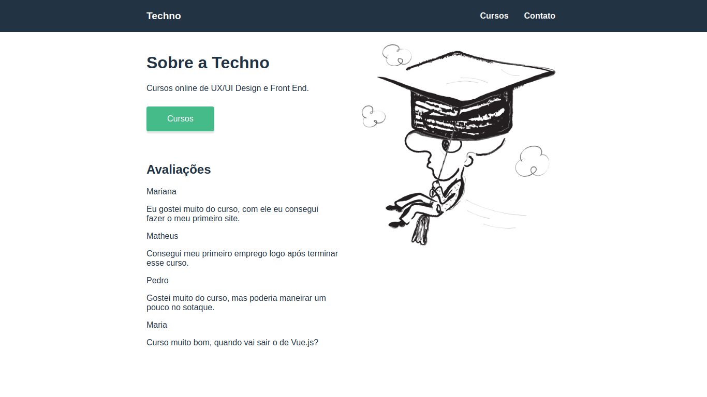

<h1 align="center">Loading Vue Component</h1>

<h2 align="center">About</h2>
   
   <p align="center">
      Simple loading animation component to Vue.js 
   </p>

---

<h2 align="center">Preview</h2>

   <p align="center">
      
   </p>

---

<h2 align="center">Technologies</h2>

- [HTML](https://html.com/)
- [CSS](https://developer.mozilla.org/pt-BR/docs/Web/CSS)
- [Vue.js](https://vuejs.org/)
- [Vue Router](https://router.vuejs.org/)
- [JSON server](https://github.com/typicode/json-server)

---

<h2 align="center">How to Use</h2>

<h3>Install Vue CLI</h3>

```
$ npm i -g @vue/cli-service-global
```

<h3>Install JSON server to fake API</h3>

```
$ npm install -g json-server
```

<h3>Start the fake API -> Set the folder API in your terminal and type</h3>

```
$ --watch api.json
```

<h3>Run the app -> In your terminal, set the folder and type </h3>

```
$ npm run serve
```

<h3>Copy in your Browser -> http://localhost:8080/</h3>

---

<h2 align="center">How to Contribute</h2>

```
- Fork the project

- Create a new branch with your changes:
$ git checkout -b my-feature

- Save your changes and create a commit message telling you what you did:
$ git commit -m "feature: My new feature"

- Submit your changes:
$ git push origin my-feature
```

---

<h2 align="center">License</h2>

<p align="center">
   This repository is under MIT license.
</p>

---
